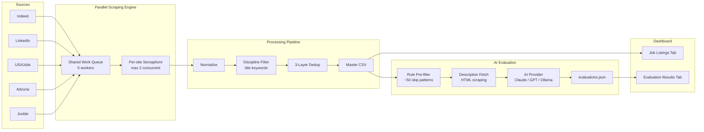

# Pharma/Biotech Job Search Tool

[](https://www.python.org/downloads/)
[](pyproject.toml)
[](LICENSE)
[](https://github.com/BioTechNerd-Apache/pharma-job-search/stargazers)
[](https://github.com/BioTechNerd-Apache/pharma-job-search/commits/main)

A Python CLI + Streamlit dashboard that aggregates pharma/biotech job listings from 5 sources and uses AI to score them against your resume profile. Supports **Anthropic (Claude)**, **OpenAI (GPT)**, and **Ollama (free local models)**.

## How It Works

```
0. SETUP             1. SEARCH          2. FILTER           3. EVALUATE          4. DASHBOARD

Upload resume   ->  Scrape 5 job   ->  Dedup + title   ->  Rule pre-filter  ->  Browse, sort,
AI generates        boards in          keyword filter       + AI scores          and review in
all config          parallel           (keep relevant)      job fit              Streamlit UI
```

**Setup** — upload your resume and the AI wizard generates your entire config (search terms, filters, evaluator patterns). **Search** across Indeed, LinkedIn, USAJobs, Adzuna, and Jooble simultaneously. **Filter** with 3-layer dedup and configurable discipline keywords. **Evaluate** with a 2-stage AI pipeline that skips obvious mismatches and scores the rest against your resume. **Review** everything in an interactive dashboard with color-coded fit scores.

## Screenshots


## Features

- **AI setup wizard**: Upload your resume and the AI generates search terms, filters, evaluator patterns, and resume profile in one step
- **Multi-provider AI**: Choose between Anthropic (Claude), OpenAI (GPT), or Ollama (free local models like Llama 3.1) — separate configs for wizard and evaluation
- **Multi-source aggregation**: Searches Indeed, LinkedIn (via [JobSpy](https://github.com/Bunsly/JobSpy)), USAJobs, Adzuna, and Jooble simultaneously
- **Smart deduplication**: 3-layer dedup (URL, fuzzy company+title+state, cross-source) eliminates duplicate listings
- **Discipline filtering**: Configurable include/exclude keyword filters keep results relevant to your field
- **AI-powered evaluation**: 2-stage pipeline — rule-based pre-filter skips obvious mismatches, then AI scores remaining jobs against your resume profile
- **Interactive dashboard**: Streamlit UI with AG Grid for browsing, filtering, and reviewing jobs across 3 tabs (Listings, Evaluations, Setup)
- **Rolling data**: Merges new results into a master CSV/Excel file, preserving your review history
- **Repost detection**: Tracks when jobs are reposted across sources

## FAQ

### Why You Can Use This Tool With Confidence

<details>
<summary><b>Does the tool store my data in the cloud or share it with anyone?</b></summary>

Everything runs locally on your machine. Job data is saved to CSV/Excel files in the `data/` folder, and your config, resume profile, and API keys stay in `config.yaml` on disk. Nothing is sent to any third-party service except: (a) job board APIs to fetch listings, and (b) your chosen AI provider (Anthropic/OpenAI/Ollama) when you run evaluation. If you use Ollama, even AI inference is fully local — no data ever leaves your machine.

</details>

<details>
<summary><b>Where are my API keys stored, and could they be accidentally committed to git?</b></summary>

API keys go in `config.yaml`, which is listed in `.gitignore` and will never be committed to git. Alternatively, you can set them as environment variables (`ANTHROPIC_API_KEY`, `OPENAI_API_KEY`, etc.) so they never touch the filesystem at all. The example config (`config.example.yaml`) contains only placeholders and is safe to commit.

</details>

<details>
<summary><b>What happens if one of the job board scrapers fails mid-run — do I lose all results?</b></summary>

No. Each scraper saves its results to the master CSV as soon as it completes (progressive save). If Indeed fails, LinkedIn, USAJobs, Adzuna, and Jooble results are still saved. The failed scraper logs an error and the rest continue unaffected. Partial results are always preserved.

</details>

<details>
<summary><b>Can re-running a search overwrite or delete jobs I've already reviewed?</b></summary>

No. The exporter uses a merge-on-save architecture: it loads the existing master CSV, merges new results, deduplicates, and saves back. Your existing jobs — including reviewed ones — are always preserved. No data is ever dropped during a merge.

</details>

<details>
<summary><b>Will reviewed jobs ever get lost or re-shuffled out of the list?</b></summary>

No. When duplicates are merged during dedup, reviewed jobs get a +1000 richness score boost — ensuring they always survive over any duplicate. Your review state is separately stored in `reviewed.json` and is restored after every merge, regardless of how many times you re-run the search.

</details>

<details>
<summary><b>How does the tool handle duplicate job postings so I don't review the same job twice?</b></summary>

Three layers of deduplication run on every search:
1. **Exact URL match** — after stripping tracking parameters (utm_*, fbclid, etc.)
2. **Fuzzy match** — normalized company + title + state, catches the same job with slightly different URLs
3. **Cross-source match** — same title + similar company across different job boards

When duplicates are found, the richest row (most data, longest description, salary info) survives. You see one clean entry per real job.

</details>

<details>
<summary><b>If a job gets reposted under a new URL after I reviewed it, will it resurface?</b></summary>

No. When you mark a job as reviewed, a fuzzy key (`company|title|state`) is written to `reviewed_fkeys.json`. On every future scrape, any new posting matching a reviewed fuzzy key is silently dropped before it can enter the master CSV — even if it has a completely different URL. Reposted jobs you have already handled will not resurface.

</details>

<details>
<summary><b>How expensive is AI evaluation — could a large run accidentally cost a lot?</b></summary>

Very cheap. Using Claude Haiku (the default), evaluation costs roughly **$0.003 per job** — 100 jobs ≈ $0.30, 1,000 jobs ≈ $3.00. Run `--eval-dry-run` before any evaluation to see an exact count and estimated cost before committing. Additionally, the rule-based pre-filter eliminates ~50% of jobs before any API call is made, so you only pay for jobs that pass the initial screen.

</details>

<details>
<summary><b>What happens if the AI evaluation run is interrupted halfway through?</b></summary>

Results are saved incrementally every 5 jobs during evaluation. If the run is interrupted (browser refresh, power loss, Ctrl+C), you keep all completed evaluations. Re-running evaluation automatically skips already-scored jobs, picking up exactly where it left off. No work is lost.

</details>

<details>
<summary><b>Will the tool misclassify jobs I'm qualified for as "skip"?</b></summary>

The pre-filter uses a rescue mechanism specifically to prevent this. If a job title matches a skip pattern (e.g., "HPLC Scientist") but also matches a rescue pattern (e.g., "qPCR", "gene therapy", "GLP"), it is **not** skipped — it proceeds to AI scoring. You can test your patterns with `--eval-prefilter-only` to see exactly which jobs would be skipped, and adjust rescue patterns in the dashboard Setup tab before they affect real evaluations.

</details>

---

### How to Use the Tool

<details>
<summary><b>How do I get started for the first time?</b></summary>

Install the tool, then open the dashboard — the Setup tab walks you through everything:

```bash
pip install git+https://github.com/BioTechNerd-Apache/pharma-job-search.git
python job_search.py --web
```

In the Setup tab: choose an AI provider, upload your resume, and click "Run Setup Wizard." The wizard generates your entire config automatically. Then run your first search from the sidebar.

> Prefer the terminal? See the [Installation Guide](docs/INSTALL_GUIDE.md) for step-by-step instructions.

</details>

<details>
<summary><b>What does the setup wizard actually do, and what does it generate?</b></summary>

The wizard reads your resume (PDF, DOCX, or TXT) and makes 3 AI calls to generate:

1. **`data/resume_profile.json`** — a structured profile of your background used by the AI evaluator
2. **Search config** (terms, filters, synonyms in `config.yaml`) — keywords tailored to your specialty
3. **`data/evaluator_patterns.yaml`** — skip/rescue/boost patterns matched to your discipline

Everything that would otherwise require manual configuration is generated in one step.

</details>

<details>
<summary><b>How do I run a basic job search?</b></summary>

```bash
python job_search.py --days 1    # Jobs posted in the last 24 hours
python job_search.py             # Default: last 7 days
python job_search.py --days 14   # Last 2 weeks
```

You can also click "Run New Search" in the dashboard sidebar. Results are saved to `data/pharma_jobs.csv` and `data/pharma_jobs.xlsx`.

</details>

<details>
<summary><b>How do I customize the search terms for my specific specialty?</b></summary>

Edit `config.yaml` under `search.terms` and `search.synonyms` — or use the Setup tab in the dashboard. Synonym groups let you define one base term that expands into several searches automatically. For example, defining "cell therapy" as a synonym group can also search "CAR-T scientist", "gene therapy", and "CGT" without listing each separately.

</details>

<details>
<summary><b>Which AI providers can I use for evaluation, and do I need a paid account?</b></summary>

Three options:

| Provider | Cost | Setup |
|----------|------|-------|
| **Ollama** | Free | Install from [ollama.com](https://ollama.com/download), run `ollama pull llama3.1:8b` |
| **Anthropic (Claude)** | Paid | API key from [console.anthropic.com](https://console.anthropic.com/settings/keys) |
| **OpenAI (GPT)** | Paid | API key from [platform.openai.com](https://platform.openai.com/api-keys) |

You can use different providers for the setup wizard vs. bulk evaluation — e.g., a powerful cloud model for the wizard, free Ollama for daily evaluation.

</details>

<details>
<summary><b>How do I evaluate jobs without running a new scrape?</b></summary>

```bash
python job_search.py --evaluate-only    # Evaluate jobs already in the master CSV
python job_search.py --eval-days 3      # Evaluate jobs from the last 3 days
python job_search.py --eval-all         # Evaluate all unevaluated jobs ever
```

Evaluation and searching are fully independent. You can scrape once and evaluate multiple times with different settings.

</details>

<details>
<summary><b>How do I see AI scores and reasoning in the dashboard?</b></summary>

Open the **Evaluation Results** tab. Jobs are color-coded by fit score:
- Green (70+) — strong fit
- Yellow (55–69) — moderate fit
- Orange (40–54) — weak fit
- Red (<40) — poor fit

Click any row to see the full reasoning, domain match, matching skills, and missing skills in a detail panel below the grid.

</details>

<details>
<summary><b>How do I mark jobs as reviewed, and does that persist across sessions?</b></summary>

In either the Job Listings or Evaluation Results tab, select rows using the checkboxes and click "Mark as Reviewed." The timestamp is saved to `reviewed.json` immediately and persists permanently across sessions. Reviewed jobs are protected from being overwritten or re-surfaced by future scrapes.

</details>

<details>
<summary><b>How do I export my top-scoring jobs to a spreadsheet?</b></summary>

```bash
python job_search.py --eval-export results.csv --eval-min-score 60
```

This exports all jobs with a fit score >= 60 to a CSV. A master Excel file (`data/pharma_jobs.xlsx`) is also updated automatically after every search — you can open it directly without any export step.

</details>

<details>
<summary><b>How do I test my filter patterns without making API calls?</b></summary>

```bash
python job_search.py --eval-prefilter-only
```

This runs only the rule-based Stage 1 pre-filter on all jobs in the master CSV, showing counts of skipped, passed, and boosted jobs — with zero API cost. Iterate on your patterns here before running full evaluation.

</details>

<details>
<summary><b>How do I create a desktop shortcut to launch the tool?</b></summary>

```bash
python job_search.py --create-shortcut
```

This creates a platform-appropriate launcher on your Desktop:
- **macOS**: `~/Desktop/Pharma Job Search.command`
- **Windows**: `~/Desktop/Pharma Job Search.bat`
- **Linux**: `~/Desktop/pharma-job-search.desktop`

Double-clicking it starts the dashboard and opens your browser automatically.

</details>

<details>
<summary><b>How do I fine-tune the AI scoring to better match my background?</b></summary>

Edit `data/resume_profile.json` — specifically:
- `strongest_fit_domains` / `moderate_fit_domains` / `skip_domains` — tells the AI which job types fit you
- `never_claim` — skills you do NOT have (prevents false matches)
- `core_technical_platforms` — instruments and techniques you know

You can also edit pre-filter patterns in `data/evaluator_patterns.yaml` (or the dashboard Setup tab) to skip or boost specific role types before they reach the AI.

</details>

---

### What Is the Advantage

<details>
<summary><b>Why search 5 job boards instead of just using Indeed or LinkedIn?</b></summary>

Coverage varies significantly by job type. USAJobs is the only source for federal, NIH, and FDA positions. Adzuna and Jooble often surface roles from company career pages that aren't on Indeed or LinkedIn. In practice, a meaningful share of unique jobs appear on only one or two boards — searching all 5 ensures you don't miss roles that would otherwise be invisible.

</details>

<details>
<summary><b>How is this different from setting up job alerts on each board individually?</b></summary>

Job alerts send you raw, unfiltered emails — with duplicates across boards, noise from irrelevant roles, and no way to compare across sources. This tool aggregates all 5 sources into a single deduplicated list, filters to your discipline by title keyword, and AI-scores each job against your specific background. You see one ranked, clean view instead of five separate inboxes full of noise.

</details>

<details>
<summary><b>What is the AI evaluation actually doing — is it just keyword matching?</b></summary>

No. The AI (Claude Haiku by default) reads the **full job description** alongside your complete resume profile — including career history, technical platforms, regulatory experience, fit domains, and skills you explicitly do NOT have. It reasons about the match holistically and returns a fit score (0–100), a recommendation (apply / maybe / skip), and a written explanation of matching and missing skills. It understands context, not just keywords.

</details>

<details>
<summary><b>How does the tool know what roles are a good fit for me?</b></summary>

Your `data/resume_profile.json` is embedded in the AI system prompt for every evaluation. It includes your career history with key skills at each role, core technical platforms, regulatory framework, fit domains you want, and a `never_claim` list of skills you don't have — which prevents the AI from giving you false positive matches. The setup wizard generates this profile automatically from your resume.

</details>

<details>
<summary><b>Why does the discipline filter only look at job titles, not descriptions?</b></summary>

Job descriptions routinely mention many disciplines in boilerplate — for example, "we hire data scientists, research scientists, and engineers" might appear in a posting for a completely unrelated role. Filtering on descriptions produces large numbers of false positives. Filtering on title only is a deliberate design decision that makes the include/exclude filters accurate and predictable.

</details>

<details>
<summary><b>How does the two-stage evaluation pipeline save API costs?</b></summary>

Stage 1 is a free, rule-based pre-filter (regex patterns on title and description) that runs before any API call. It skips obvious mismatches — VP-level roles, QC technician roles, data scientist roles, and so on. In practice this eliminates roughly **50% of jobs** before the AI ever sees them, cutting your API costs roughly in half. Only jobs that pass the screen are sent to the AI.

</details>

<details>
<summary><b>What is the pre-filter stage and why does it matter?</b></summary>

The pre-filter (Stage 1) applies ~50 regex patterns on job titles and ~15 on descriptions to identify obvious non-matches at zero cost. This not only saves money — it also speeds up evaluation significantly, since the AI never wastes time reading a job you'd clearly skip. Run `--eval-prefilter-only` to test the pre-filter in isolation and tune your patterns before committing to full evaluation.

</details>

<details>
<summary><b>What does the "rescue" pattern mechanism do?</b></summary>

Rescue patterns prevent the pre-filter from over-rejecting borderline jobs. If a job title matches a skip pattern (e.g., "HPLC Scientist") but also contains a rescue keyword (e.g., "GLP", "gene therapy", "qPCR"), the skip is overridden and the job proceeds to AI scoring. This catches edge cases where a job title sounds like a mismatch but the actual role is relevant to you.

</details>

<details>
<summary><b>What does a reposted date tell me about a job?</b></summary>

When the same job appears under different URLs across boards or scrape runs, the duplicate posting dates are collected in the `reposted_date` column. A job that keeps being reposted is one the company hasn't been able to fill — it signals an **active, urgent opening** worth prioritizing. You can filter by reposted jobs in the dashboard sidebar.

</details>

<details>
<summary><b>Can I use this tool for fields outside pharma/biotech?</b></summary>

Yes. The pharma/biotech configuration is the default, but every aspect is configurable: search terms, discipline filters, pre-filter patterns, and the resume profile. Changing these four layers adapts the tool to any job search domain. The setup wizard also tailors everything to whatever resume you upload, so it reads your field automatically and generates domain-appropriate config.

</details>

---

## Architecture



## Quick Start

> **New to the command line?** Follow the [step-by-step Installation Guide](docs/INSTALL_GUIDE.md) instead — it covers Windows and Mac with screenshots and troubleshooting.

### 1. Install

**One-command install (any platform):**
```bash
pip install git+https://github.com/BioTechNerd-Apache/pharma-job-search.git
```

This installs all dependencies and creates a `pharma-job-search` CLI command.

**Or clone and install locally:**
```bash
git clone https://github.com/BioTechNerd-Apache/pharma-job-search.git
cd pharma-job-search
pip install -r requirements.txt
```

### 2. Configure

Launch the dashboard and use the **Setup tab** to configure everything through the GUI:

```bash
python job_search.py --web
```

The Setup tab lets you choose an AI provider, upload your resume, run the setup wizard, edit search terms/filters, and manage API keys — all from the browser. `config.yaml` is auto-created on first launch.

<details>
<summary><b>Terminal alternative</b></summary>

```bash
cp config.example.yaml config.yaml          # macOS/Linux
copy config.example.yaml config.yaml         # Windows
python job_search.py --setup resume.pdf      # AI wizard from CLI
```

</details>

> **No AI key?** Use Ollama for free local inference. See [AI Providers](#ai-providers) below.

<details>
<summary><b>Manual setup (alternative to wizard)</b></summary>

Copy and edit the resume profile template:

**macOS / Linux:**
```bash
cp data/resume_profile.example.json data/resume_profile.json
```

**Windows:**
```cmd
copy data\resume_profile.example.json data\resume_profile.json
```

Edit `data/resume_profile.json` with your actual background, and customize search terms/filters in `config.yaml`.

</details>

### 3. Run a search

```bash
python job_search.py --days 1    # Search for jobs posted in the last 24 hours
```

### 4. View the dashboard

```bash
python job_search.py --web
```

> **Dashboard search button:** The dashboard has a "Run New Search" button in the sidebar. Clicking it will scrape all 5 job boards for the last 7 days (the default in `config.yaml`). It does **not** run AI evaluation — that requires the CLI (`python job_search.py --evaluate`). To change the search window, edit the `days` value under `search:` in `config.yaml`.

### 5. Create a desktop shortcut (optional)

```bash
pharma-job-search --create-shortcut   # pip install
python job_search.py --create-shortcut # clone install
```

This creates a platform-appropriate shortcut on your Desktop that launches the dashboard and opens your browser:
- **macOS**: `~/Desktop/Pharma Job Search.command`
- **Windows**: `~/Desktop/Pharma Job Search.bat`
- **Linux**: `~/Desktop/pharma-job-search.desktop`

<details>
<summary><b>Manual shortcut creation</b></summary>

**macOS** — save as `~/Desktop/Pharma Job Search.command`, then `chmod +x` it:
```bash
#!/bin/bash
pharma-job-search --web &
echo 'Waiting for dashboard to start...'
for i in $(seq 1 30); do
  curl -s http://localhost:8501 >/dev/null 2>&1 && break
  sleep 1
done
open http://localhost:8501
```

**Windows** — save as `~/Desktop/Pharma Job Search.bat`:
```batch
@echo off
start "" pharma-job-search --web
echo Waiting for dashboard to start...
:wait_loop
timeout /t 2 /nobreak >nul
curl -s http://localhost:8501 >nul 2>&1 && goto :open_browser
goto :wait_loop
:open_browser
start http://localhost:8501
```

**Linux** — save as `~/Desktop/pharma-job-search.desktop`, then `chmod +x` it:
```ini
[Desktop Entry]
Type=Application
Name=Pharma Job Search
Exec=pharma-job-search --web
Terminal=true
Categories=Utility;
```

> If you cloned the repo instead of pip-installing, replace `pharma-job-search --web` with `python /path/to/job_search.py --web`.

</details>

## AI Providers

The tool supports three AI providers for the setup wizard and job evaluation. You can use different providers for each (e.g., a powerful model for the wizard, a cheap/fast model for bulk evaluation).

| Provider | Cost | Models | Setup |
|----------|------|--------|-------|
| **Anthropic (Claude)** | Paid | claude-haiku-4-5, claude-sonnet-4-5, claude-opus-4 | Get key at [console.anthropic.com](https://console.anthropic.com/settings/keys) |
| **OpenAI (GPT)** | Paid | gpt-4o-mini, gpt-4o, gpt-4.1 | Get key at [platform.openai.com](https://platform.openai.com/api-keys) |
| **Ollama (free)** | Free | llama3.1:8b, gemma3:12b, mistral:7b | Install from [ollama.com/download](https://ollama.com/download), then `ollama pull llama3.1:8b` |

Configure in `config.yaml` under `wizard:` and `evaluation:` sections, or use the dashboard Setup tab.

## API Keys

| Source | Required? | Where to Register |
|--------|-----------|-------------------|
| Indeed | No | Works via JobSpy, no key needed |
| LinkedIn | No | Works via JobSpy, no key needed |
| USAJobs | Optional | [developer.usajobs.gov](https://developer.usajobs.gov/) |
| Adzuna | Optional | [developer.adzuna.com](https://developer.adzuna.com/) |
| Jooble | Optional | [jooble.org/api/about](https://jooble.org/api/about) |
| Anthropic | For AI | [console.anthropic.com](https://console.anthropic.com/settings/keys) |
| OpenAI | For AI | [platform.openai.com](https://platform.openai.com/api-keys) |

You can set API keys in `config.yaml` or via environment variables:
- `ANTHROPIC_API_KEY`, `OPENAI_API_KEY`
- `USAJOBS_API_KEY`, `USAJOBS_EMAIL`
- `ADZUNA_APP_ID`, `ADZUNA_APP_KEY`
- `JOOBLE_API_KEY`

**Note**: Indeed and LinkedIn work without any API keys. You can start searching immediately after install. For AI features, you can use Ollama for free local inference — no API key needed.

## CLI Reference

### Setup

```bash
python job_search.py --setup resume.pdf   # AI wizard: generates all config from resume
```

### Search Commands

```bash
python job_search.py                    # Full search (default: last 7 days)
python job_search.py --days 1           # Last 24 hours
python job_search.py --days 14          # Last 2 weeks
python job_search.py --reprocess        # Re-filter/dedup from raw data (no scraping)
python job_search.py --web              # Launch dashboard only
python job_search.py --create-shortcut  # Create desktop shortcut
```

### Evaluation Commands

```bash
python job_search.py --evaluate               # Search + evaluate new jobs
python job_search.py --evaluate-only           # Evaluate without searching
python job_search.py --eval-days 3            # Evaluate jobs from last 3 days
python job_search.py --eval-all               # Evaluate all unevaluated jobs
python job_search.py --eval-prefilter-only    # Rule-based filter only (no API cost)
python job_search.py --eval-dry-run           # Show count + cost estimate
python job_search.py --eval-summary           # Show evaluation statistics
python job_search.py --eval-export results.csv --eval-min-score 60  # Export results
python job_search.py --re-evaluate            # Force re-evaluation of scored jobs
```

## Dashboard

The Streamlit dashboard has three tabs:

- **Job Listings**: Browse all scraped jobs with sortable/filterable AG Grid. Mark jobs as reviewed.
- **Evaluation Results**: View AI-scored jobs with color-coded fit scores (green = strong fit, red = poor fit).
- **Setup**: Configure AI providers (wizard + evaluation), run the setup wizard, edit search terms/filters/patterns, and manage your resume profile.

Both job tabs share the review system — select rows and click "Mark Reviewed" to track which jobs you've looked at.

## Customization Guide

This tool ships pre-configured for **pharma/biotech scientist** roles. There are 4 layers to customize for your background:

### Layer 1: Search Terms (`config.yaml` → `search.terms` + `search.synonyms`)

**What they do**: These keywords are sent to job boards. Each term in `synonyms` auto-expands — e.g., searching for "cell gene therapy" also searches "CGT scientist", "CAR-T scientist", "gene therapy", "cell therapy".

**To customize**: Replace terms with your discipline's job titles and keywords. The synonym groups reduce the number of base terms you need.

### Layer 2: Discipline Filters (`config.yaml` → `search.filter_include` + `search.filter_exclude`)

**What they do**: After scraping, jobs are filtered by **title only** (not description — this prevents false positives). A job must match at least one `filter_include` keyword AND match zero `filter_exclude` keywords to be kept.

**To customize**: Replace include keywords with terms relevant to your field. The exclude list filters out irrelevant roles (sales, nursing, IT, etc.) — most of it is broadly useful, but review it for your domain.

### Layer 3: Pre-filter Patterns (`data/evaluator_patterns.yaml`)

**What they do**: Before sending jobs to the AI for scoring (which costs money), a rule-based pre-filter runs:
- **Skip patterns** (~50 regex patterns on title, ~15 on description): Auto-skip obvious mismatches (e.g., VP roles, QC technicians, HPLC-focused positions, data scientists)
- **Rescue patterns** (~15 patterns): Override skips — if a job matches both skip AND rescue (e.g., "HPLC" in description but also "qPCR"), it is NOT skipped
- **Boost patterns** (~15 patterns): Jobs matching these get evaluated first (e.g., bioanalytical, gene therapy, CAR-T)

**To customize**: The setup wizard generates `data/evaluator_patterns.yaml` tailored to your resume. You can also edit patterns in the dashboard Setup tab, or hand-edit the YAML. If the YAML file doesn't exist, built-in defaults are used. Run `--eval-prefilter-only` to test your patterns without API cost.

### Layer 4: Resume Profile (`data/resume_profile.json`)

**What they do**: The AI evaluator (Claude Haiku) reads this profile to score how well each job matches your background. The profile includes your career history, technical platforms, regulatory experience, and fit domains.

**To customize**: Copy `data/resume_profile.example.json` to `data/resume_profile.json` and fill in your actual background. Key fields:

| Field | Purpose |
|-------|---------|
| `career_anchors` | Your work history — skills at each position |
| `core_technical_platforms` | Instruments/techniques you know |
| `regulatory_framework` | GLP, GMP, FDA experience etc. |
| `strongest_fit_domains` | Job types that match you best (scored highest) |
| `moderate_fit_domains` | Decent matches (scored moderately) |
| `skip_domains` | Poor matches (scored low) |
| `never_claim` | Skills/platforms you do NOT have (prevents false matches) |

### Getting Started Without API Keys

You can run a basic search with **zero API keys** — Indeed and LinkedIn work immediately via JobSpy:

```bash
pip install git+https://github.com/BioTechNerd-Apache/pharma-job-search.git
cp config.example.yaml config.yaml
pharma-job-search --days 1             # Scrapes Indeed + LinkedIn
pharma-job-search --web                # View results in dashboard
```

Add USAJobs/Adzuna/Jooble keys for more sources. For AI features (setup wizard + evaluation), use an Anthropic/OpenAI key or install [Ollama](https://ollama.com/download) for free local inference.

## Project Structure

```
job_search.py                # CLI entry point
pyproject.toml               # Package config (pip installable)
config.yaml                  # Your configuration (not tracked by git)
config.example.yaml          # Template configuration
src/
  config.py                  # YAML loader + dataclasses (AppConfig, WizardConfig, EvaluationConfig)
  ai_client.py               # Multi-provider AI client (Anthropic, OpenAI, Ollama)
  setup_wizard.py            # AI-powered setup wizard (resume → full config)
  resume_parser.py           # Resume text extraction (PDF, DOCX, TXT)
  pattern_helpers.py         # Regex ↔ display string conversion for pattern editor
  aggregator.py              # Orchestrator with parallel scraping
  dedup.py                   # 3-layer deduplication
  exporter.py                # CSV/Excel merge-on-save
  dashboard.py               # Streamlit UI with AG Grid (3 tabs)
  scraper_jobspy.py          # Indeed/LinkedIn via python-jobspy
  scraper_usajobs.py         # USAJobs REST API
  scraper_adzuna.py          # Adzuna REST API
  scraper_jooble.py          # Jooble REST API
  evaluator.py               # 2-stage evaluation pipeline
  eval_persistence.py        # JSON persistence for evaluations
  description_fetcher.py     # HTML scraping for job descriptions
  resume_profile.py          # Resume profile loader
tests/
  test_evaluator.py          # Tests for rule-based pre-filter
  test_ai_client.py          # Tests for multi-provider AI client
  test_setup_wizard.py       # Tests for setup wizard
  test_resume_parser.py      # Tests for resume text extraction
  test_pattern_helpers.py    # Tests for regex display helpers
data/
  resume_profile.json        # Your resume profile (generated/not tracked)
  resume_profile.example.json # Template resume profile
  evaluator_patterns.yaml    # Evaluator patterns (generated/not tracked)
  pharma_jobs.csv            # Master job data (generated)
  pharma_jobs.xlsx           # Master job data (generated)
docs/
  CLAUDE.md                  # Full project instructions for AI assistants
  PROJECT_REFERENCE.md       # Complete source code reference
  PRD.md                     # Product requirements document
```

## Requirements

- Python 3.10+
- macOS, Linux, or Windows
- Dependencies are installed automatically via `pip install`; see [`pyproject.toml`](pyproject.toml) or `requirements.txt` for the full list
- For AI features: an API key for Anthropic or OpenAI, **or** [Ollama](https://ollama.com/download) installed locally (free)

## Contributing

See [CONTRIBUTING.md](CONTRIBUTING.md) for how to set up a dev environment, customize for your discipline, and submit changes.

## License

MIT License. See [LICENSE](LICENSE) for details.
